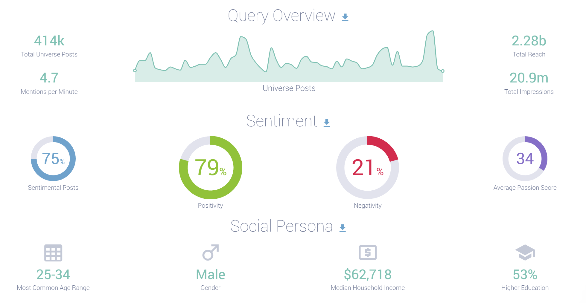

# library

```{r, message=FALSE, warning=FALSE}

if (!require("pacman")) install.packages("pacman")

pacman::p_load(
  tidyverse,
  lubrsourceate,
  textclean,
  qdapRegex,
  tidytext,
  textdata,
  tm,
  wordcloud,
  ggeasy,
  igraph,
  networkD3,
  magrittr
)  


# library(tidyverse)
# library(lubrsourceate)
# library(textclean)
# library(qdapRegex)
# library(tidytext)
# library(textdata) # get dictionary "nrc"
# library(tm) # for corpus 
# library(wordcloud)
# library(ggeasy) # plotting
# library(igraph) # plot network
# library(networkD3) # graph 3D network
# library(magrittr) # to use assignment pipe %<>%

getwd()
```

```{r}
df <- rio::import("Riot Games - posts.xlsx") %>% 
  mutate(published = as.Date(published, "%Y-%m-%d"))
head(df)

dt <- df %>% 
  select(published, source, body, sentiment) %>% 
  arrange(published)

overview <- dt %>% 
  group_by(published) %>% 
  count() %>% 
  ungroup() %>% 
  arrange(published)

plot(overview)
```

# Clean text

Using `textclean` [library](https://cran.r-project.org/web/packages/textclean/readme/README.html)

`qdapRegex` [library](https://cran.r-project.org/web/packages/qdapRegex/qdapRegex.pdf)

```{r}
dt <- dt %>% 
  mutate(body = gsub("\\$", "", body)) %>% 
  
  mutate(body = gsub("@\\w+", "", body)) %>% 
  
  mutate(body = gsub("[[:punct:]]","", body)) %>% 
  
  mutate(body = gsub("http\\w+", "", body)) %>% 
  
  mutate(body = gsub("[ |\t]{2,}", "", body)) %>% 
  
  mutate(body = gsub("^ ", "", body)) %>% 
  
  mutate(body = gsub(" $", "", body)) %>% 
  
  mutate(body = gsub("RT","",body)) %>% # remove RT (i.e., retweet)
  
  mutate(body = gsub("href", "", body)) %>% 
  
  mutate(body = gsub("([0-9])","", body))
```

```{r}
dt$clean_text <- dt$body %>%
  replace_contraction() %>%           # isn't -> is not
  tolower() %>%
  rm_non_words() %>%
  rm_number() %>%
  rm_repeated_characters() %>%
  rm_repeated_phrases() %>%
  rm_repeated_words() %>%
  rm_non_ascii() %>%             # not in alphabet
  rm_endmark() %>%
  rm_tag() %>%
  rm_url(replacement = "") %>%   # remove url
  
  
  replace_date(replacement = "") %>%  # remove dates
  replace_time(replace = "") %>%      # remove time
  replace_number(remove = T) %>%      # remove numbers
  rm_email %>%
  rm_emoticon(clean = TRUE, replacement = "") %>%
  replace_hash() %>%
  replace_html(symbol = FALSE) %>%    # remove html
  replace_internet_slang() %>%
  
  # replace_incomplete(replacement = "") %>% # remove incomplete sentence end marks
  replace_kern() %>%                  # adjustment of spacing
  rm_white() %>%                      # remove white space
  add_comma_space()                   # add space after a comma
# drop_NA() # remove empty rows
  


# check for potential issues 
# check_text(dt$clean_text)
```


# Word Cloud

```{r}
text_corpus <-
  Corpus(VectorSource(dt$clean_text[1:1000])) %>%
  tm_map(content_transformer(tolower)) %>%
  tm_map(function(x)
    removeWords(x, stopwords("english"))) #%>%
# tm_map(removeWords, c("global", "globalwarming"))


tdm <- TermDocumentMatrix(text_corpus) %>% 
  as.matrix() 

tdm <-sort(rowSums(tdm), decreasing = TRUE)

tdm <- data.frame(word = names(tdm), freq = tdm)
set.seed(123)
wordcloud(
  text_corpus,
  min.freq = 1,
  max.words = 100,
  scale = c(2.2, 1),
  colors = brewer.pal(8, "Dark2"),
  random.color = T,
  random.order = F
)
```

```{r}
ggplot(tdm[1:20, ], aes(x = reorder(word, freq), y = freq)) +
  geom_bar(stat = "identity") +
  xlab("Terms") +
  ylab("Count") +
  coord_flip() +
  theme(axis.text = element_text(size = 7)) +
  ggtitle('Most common word frequency plot') +
  ggeasy::easy_center_title()
```

Alternatively

```{r}
tokens <- data_frame(text = dt$clean_text) %>%
    unnest_tokens(word, text) %>%
    anti_join(stop_words) %>%
    count(word, sort = TRUE)
```


# Sentiment Analysis

```{r}
dt %>%
  group_by(sentiment) %>%
  count() %>%
  
  ggplot(aes(x = sentiment, y = n)) +
  geom_bar(stat = "identity", aes(fill = sentiment)) +
  ggtitle("Sentiment Plot")
```


# Network Analysis

Script by [jtr13](https://jtr13.github.io/cc21/twitter-sentiment-analysis-in-r.html)

```{r}
#bigram
bi.gram.words <- dt %>% 
  unnest_tokens(
    input = clean_text, 
    output = bigram, 
    token = 'ngrams', 
    n = 2
  ) %>% 
  filter(! is.na(bigram))

bi.gram.words %>% 
  select(bigram) %>% 
  head(10)
```

```{r}
extra.stop.words <- c('https')
stopwords.df <- tibble(
  word = c(stopwords(kind = 'es'),
           stopwords(kind = 'en'),
           extra.stop.words)
)


bi.gram.words %<>%
  separate(col = bigram,
           into = c('word1', 'word2'),
           sep = ' ') %>%
  filter(!word1 %in% stopwords.df$word) %>%
  filter(!word2 %in% stopwords.df$word) %>%
  filter(!is.na(word1)) %>%
  filter(!is.na(word2)) 
```

Group and count by bigram

```{r}
bi.gram.count <- bi.gram.words %>% 
  dplyr::count(word1, word2, sort = TRUE) %>% 
  dplyr::rename(weight = n)

bi.gram.count %>% head()
```

view weight distribution
```{r}
bi.gram.count %>% 
  ggplot(mapping = aes(x = weight)) +
  theme_light() +
  geom_histogram() +
  labs(title = "Bigram Weight Distribution")
```

Note that it is very skewed, for visualization purposes it might be a good idea to perform a transformation, eg log transform:

```{r}
bi.gram.count %>% 
  mutate(weight = log(weight + 1)) %>% 
  ggplot(mapping = aes(x = weight)) +
  theme_light() +
  geom_histogram() +
  labs(title = "Bigram log-Weight Distribution")
```

To define weighted network from a bigram count we used the following structure.

Each word is going to represent a node.
Two words are going to be connected if they appear as a bigram.
The weight of an edge is the number of times the bigram appears in the corpus.

```{r}
threshold <- 50

# For visualization purposes we scale by a global factor. 
ScaleWeight <- function(x, lambda) {
  x / lambda
}

network <-  bi.gram.count %>%
  filter(weight > threshold) %>%
  mutate(weight = ScaleWeight(x = weight, lambda = 2E3)) %>% 
  graph_from_data_frame(directed = FALSE)

plot(
  network, 
  vertex.size = 1,
  vertex.label.color = 'black', 
  vertex.label.cex = 0.7, 
  vertex.label.dist = 1,
  edge.color = 'gray', 
  main = 'Bigram Count Network', 
  sub = glue('Weight Threshold: {threshold}'), 
  alpha = 50
)
```

Make this dynamic

```{r}
threshold <- 50

network <-  bi.gram.count %>%
  filter(weight > threshold) %>%
  graph_from_data_frame(directed = FALSE)

# Store the degree.
V(network)$degree <- strength(graph = network)
# Compute the weight shares.
E(network)$width <- E(network)$weight / max(E(network)$weight)

# Create networkD3 object.
network.D3 <- igraph_to_networkD3(g = network)
# Define node size.
network.D3$nodes %<>% mutate(Degree = (1E-2) * V(network)$degree)
# Define color group
network.D3$nodes %<>% mutate(Group = 1)
# Define edges width.
network.D3$links$Width <- 10 * E(network)$width

forceNetwork(
  Links = network.D3$links,
  Nodes = network.D3$nodes,
  Source = 'source',
  Target = 'target',
  NodeID = 'name',
  Group = 'Group',
  opacity = 0.9,
  Value = 'Width',
  Nodesize = 'Degree',
  # We input a JavaScript function.
  linkWidth = JS("function(d) { return Math.sqrt(d.value); }"),
  fontSize = 12,
  zoom = TRUE,
  opacityNoHover = 1
)
```

Compare to Infegy dashboard



# Brand Reputation

```{r}
dict <- rio::import(file.path(getwd(), "dictionary.xlsx")) %>% 
  mutate(`Positive Dict` = gsub(pattern = ", ",replacement = "|", x = `Positive Dict`),
         `Negative Dict` = gsub(pattern = ", ",replacement = "|", x = `Negative Dict`))
```

```{r}
br_df <- dt %>%
  mutate(
    pos_price         = str_count(clean_text, dict$`Positive Dict`[1]),
    pos_serv_qual     = str_count(clean_text, dict$`Positive Dict`[2]),
    pos_goods_qual    = str_count(clean_text, dict$`Positive Dict`[3]),
    pos_cool          = str_count(clean_text, dict$`Positive Dict`[4]),
    pos_exciting      = str_count(clean_text, dict$`Positive Dict`[5]),
    pos_innovative    = str_count(clean_text, dict$`Positive Dict`[6]),
    pos_csr           = str_count(clean_text, dict$`Positive Dict`[7]),
    pos_community     = str_count(clean_text, dict$`Positive Dict`[8]),
    pos_friendly      = str_count(clean_text, dict$`Positive Dict`[9]),
    pos_personal_rela = str_count(clean_text, dict$`Positive Dict`[10]),
    pos_trustworthy   = str_count(clean_text, dict$`Positive Dict`[11]),
    
    neg_price         = str_count(clean_text, dict$`Negative Dict`[1]),
    neg_serv_qual     = str_count(clean_text, dict$`Negative Dict`[2]),
    neg_goods_qual    = str_count(clean_text, dict$`Negative Dict`[3]),
    neg_cool          = str_count(clean_text, dict$`Negative Dict`[4]),
    neg_exciting      = str_count(clean_text, dict$`Negative Dict`[5]),
    neg_innovative    = str_count(clean_text, dict$`Negative Dict`[6]),
    neg_csr           = str_count(clean_text, dict$`Negative Dict`[7]),
    neg_community     = str_count(clean_text, dict$`Negative Dict`[8]),
    neg_friendly      = str_count(clean_text, dict$`Negative Dict`[9]),
    neg_personal_rela = str_count(clean_text, dict$`Negative Dict`[10]),
    neg_trustworthy   = str_count(clean_text, dict$`Negative Dict`[11])
  ) %>% 
  
  rowwise() %>% 
  mutate(
    pos_value = sum(pos_price, pos_serv_qual, pos_goods_qual),
    pos_brand = sum(pos_cool, pos_exciting, pos_innovative, pos_csr),
    pos_rela  = sum(
      pos_community,
      pos_friendly,
      pos_personal_rela,
      pos_trustworthy
    ),
    
    neg_value = sum(neg_price, neg_serv_qual, neg_goods_qual),
    neg_brand = sum(neg_cool, neg_exciting, neg_innovative, neg_csr),
    neg_rela  = sum(
      neg_community,
      neg_friendly,
      neg_personal_rela,
      neg_trustworthy
    )
  ) %>% 
  ungroup() %>% 
  
  group_by(published) %>% 
  summarize(pos_value_daily = sum(pos_value),
            pos_brand_daily = sum(pos_brand),
            pos_rela_daily  = sum(pos_rela),
            
            neg_value_daily = sum(neg_value), 
            neg_brand_daily = sum(neg_brand), 
            neg_rela_daily  = sum(neg_rela)
            ) %>% 
  
  replace(is.na(.), 0) %>% 


  mutate(net_value = pos_value_daily - neg_value_daily,
         net_brand = pos_brand_daily - neg_brand_daily,
         net_rela  = pos_rela_daily  - neg_rela_daily)

# scaled data frame
scaled_br_df <- br_df %>%
  mutate_if(is.integer,  ~ (scale(.) %>% as.vector)) %>%
  
  rowwise() %>%
  mutate(
    mean_pos_reputation_daily = mean(pos_value_daily, pos_brand_daily, pos_rela_daily),
    mean_neg_reputation_daily = mean(neg_value_daily, neg_brand_daily, neg_rela_daily),
    mean_net_reputation_daily = mean(net_value, net_brand, net_rela)
  ) %>% 
  ungroup()


# check
(br_df$pos_value_daily[1] - mean(br_df$pos_value_daily))/sd(br_df$pos_value_daily)
```

Plot

```{r}
scaled_br_df %>% 
  select(published, mean_pos_reputation_daily) %>% 
  plot()

scaled_br_df %>% 
  select(published, mean_neg_reputation_daily) %>% 
  plot()

scaled_br_df %>% 
  select(published, mean_net_reputation_daily) %>% 
  plot()
```

